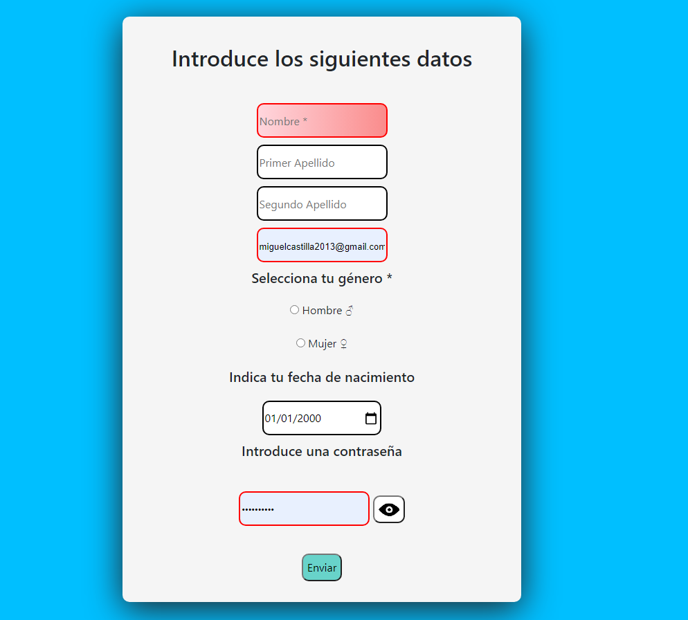

# Practica 6
##  Miguel Castilla Criado 
### **INTERACCIÓN CON EL USUARIO**

<a href= '../README.md'>Pagina Principal</a>

<a href= '../P6/'>Ficheros Practica 6</a>

### **Formulario de usuario**

En el formulario recogeremos el nombre apellidos, fecha de nacimiento, género, email y contraseña. Nombre y apellidos serán tipo "text", email será de tipo "email", genero será de tipo "radio", fecha de tipo "date" y contraseña de tipo "password"
Enviaremos los datos a server.php mediante Post

	<form  name="recoger"  action="server.php"  method="post"  id="recoger">

		<label  for="title"  id="title">

			<h2>Introduce los siguientes datos</h2>

		</label>  

			<input  class="Intext"  type="text"  name="name"  placeholder="Nombre *" id="name"  required> 

			<input  class="Intext"  type="text"  name="apellido1"  placeholder="Primer Apellido"  id="apellido1"> 

			<input  class="Intext"  type="text"  name="apellido2"  placeholder="Segundo Apellido"  id="apellido2"> 

			<input  class="Intext"  type="email"  name="email"  id="email"  placeholder=" usuario@gmail.com *"  required> 

		<label>

			<h5>Selecciona tu género *</h5>

		</label> 

			<input  type="radio"  class="sexo"  name="genero"  value="Hombre"  required> Hombre ♂  

			<input  type="radio"  class="sexo"  name="genero"  value="Mujer"  required> Mujer ♀ 

		<label>

			<h5>Indica tu fecha de nacimiento</h5>

		</label> 

			<input  class="Intext"  type="date"  name="date"  id="date"  value="2000-01-01"> 

		<label>

		<h5>Introduce una contraseña</h5>

	</label> 

		<input  class="Intext"  type="password"  name="password"  id="password"  placeholder="Contraseña *"  required>

		<button  id="mostrarpasswd"  type=button  onclick="mostrarContraseña()"  value="Mostrar Contraseña"></button> 

	<input  class="botones"  type=button  onclick="Validar()"  value="Enviar">

	</form>        

### **Funciones**

La función enviar recibe los datos que ha introducido el usuario por el formulario y los muestra mediante un confirm en el que si pulsamos aceptar mandará los datos a server.php y si pulsamos cancelar nos mantendrá en la página de formulario

	function  Enviar()  {
		var datos =  "";

		var name = document.recoger.name.value;

		var apellido1 = document.recoger.apellido1.value;

		var apellido2 = document.recoger.apellido2.value;

		var email = document.recoger.email.value;

		var genero = document.recoger.genero.value

		var date = document.recoger.date.value;

		var password = document.recoger.password.value;

	  

		if  (confirm("\n Usuario: "  + name +  "  "  + apellido1 +  "  "  + apellido2 +  "\n Email: "  + email +  "\n Género: "  + genero +  "\n Fecha de Nacimiento: "  + date +  "\n Contraseña: "  + password +  "\n  \n Son estos datos correctos?"))  {
			document.recoger.submit()
		}
		var opcion =  false;
		if  (opcion ==  true)  {
			window.location.href =  "server.php";
		}  else  {
			returnToPreviousPage();
			}
	}

Con esta función se comprueba que todos los campos del formulario estén rellenos, en caso de que falten campos mandará un alert para que rellene los campos restantes y si están todos rellenos se llama a la función ***Enviar*** (Explicada anteriormente)
	  

	function  Validar()  {

		var datos =  "";

		var name = document.recoger.name.value;

		var apellido1 = document.recoger.apellido1.value;

		var apellido2 = document.recoger.apellido2.value;

		var email = document.recoger.email.value;

		var genero = document.recoger.genero.value

		var date = document.recoger.date.value;

		var password = document.recoger.password.value;

	  

		if  (name ===  ""  || apellido1 ===  ""  || apellido2 ===  ""  || email ===  ""  ||genero ===  ""  ||password ===  "")  {
			alert("Debes rellenar todos los campos");
		return  false;
		}  else  {
		Enviar();
			}
	}

	  
Esta funcion se ejecuta al pulsar el botón al lado de la contraseña en el formulario.
Si lo pulsamos y está en tipo password se pasará a tipo text pudiendo ver los escrito de esta forma y viceversa
	function  mostrarContraseña()  {

		var mostrar = document.getElementById("password");
		if  (mostrar.type ==  "password")  {
			mostrar.type =  "text";
		}  else  {
			mostrar.type =  "password";
			}
	}

### **Server.php**

Este fichero simplemente recoge los datos introducidos por el formulario y mostrarlos por pantalla

	<?php

		error_reporting(0);
		$nombre =  $_POST['name'];
		$apellido1 =  $_POST['apellido1'];
		$apellido2 =  $_POST['apellido2'];
		$genero =  $_POST["genero"];
		$email =  $_POST["email"];
		$fecha =  $_POST["date"];
		
		echo  "<h4>Nombre y apellidos</h4>"  .  $nombre .  "  "  .  $apellido1 .  "  "  .  $apellido2 .  " ";
		echo  "  <h5>Correo Electrónico</h5>"  .  $email .  " ";
		if  ($genero ==  null)  {	
			echo  "  <h5>Género</h5> No especificado  ";
		}  else  {
			echo  "  <h5>Género</h5>"  .  $genero .  " ";
			}
		echo  "  <h5>Fecha de Nacimiento</h5>"  .  $fecha .  " ";
	?>
    
### **Estilos**
    
Este es el fichero css para darle forma al formulario 

    #cuerpo {
        text-align: center;
        font-size: 27px;
        font-family: arial;
    }

    .tablaperson {
        border-style: solid;
        border-color: aquamarine;
        background-color:aliceblue;
        text-align: center;
        margin: 20px;

    }

    td{
        text-align: center;
        padding-left: 30px;
        padding-right: 30px;
        padding-top: 10px

    }
    th{
        text-align: center;
        padding-left: 30px;
        padding-right: 30px;
        background-color: darkturquoise;

    }

    body {
        background-color: azure;
    }

    #añadir {
        float:left;
        margin-left: 35%;
    }

    #borrar {
        float: right;
        margin-right: 40%;
    }

    #name {
        border-top-left-radius: 20px;
    }

    #2apellido {
        border-top-right-radius: 20px;
    }

    .button {
        background-color:aquamarine;
        border: none;
        color: black;
        padding: 15px 32px;
        text-align: center;
        text-decoration: none;
        display: inline-block;
        font-size: 16px;
        margin: 4px 2px;
        cursor: pointer;
        border-radius: 20px;
    }

    
[Volver arriba](#Practica-6)
