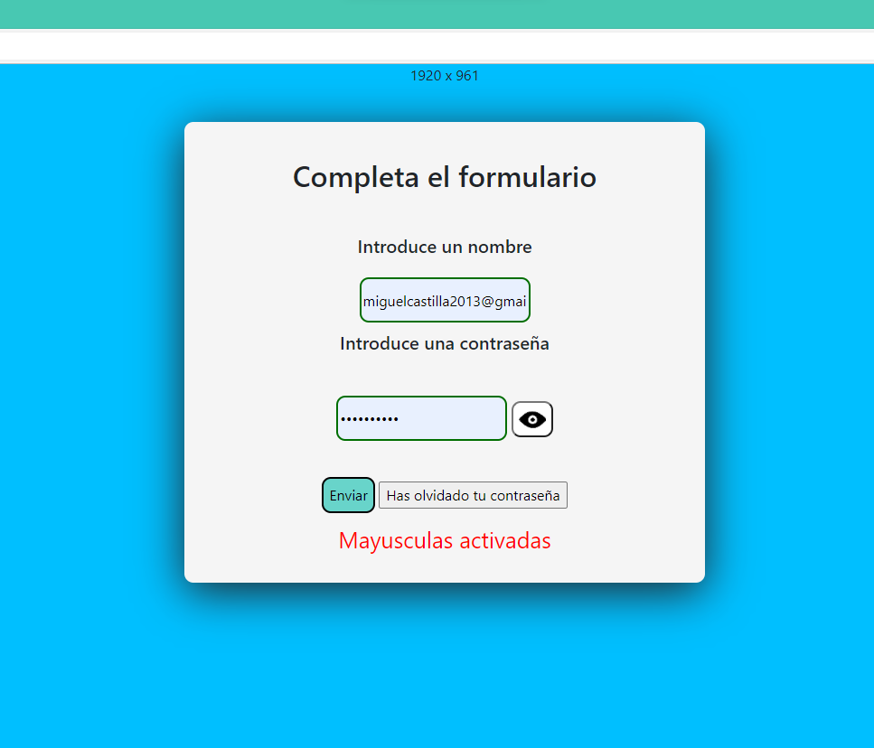

# Practica 7
##  Miguel Castilla Criado 
### **INTERACCIÓN CON EL USUARIO**

<a href= '../../README.md'>Pagina Principal</a>

<a href= '../P7/'>Ficheros Practica 7</a>

### **Formulario de usuario**

En el formulario recogeremos el nombre a y contraseña. Nombre será de tipo "text"y contraseña de tipo "password"
Enviaremos los datos a server.php mediante Post
    
    <form action="server.php" method="post">
            <label for="title" id="title">
                <h2>Completa el formulario</h2>
            </label>  
            <label>
                <h5>Introduce un nombre</h5>
            </label> 
            <input class="Intext" type="text" name="name" placeholder="Nombre *" id="name" required> 
            <label>
                <h5>Introduce una contraseña</h5>
            </label> 
            <input class="Intext" type="password" name="password" id="password" placeholder="Contraseña *" required
                onmousemove="Mayus()">
            <button id="mostrarpasswd" type=button onclick="mostrarContraseña()" value="Mostrar Contraseña"></button> 
            <input class="botones" type="submit" value="Enviar">
            <input type="button" id="reset" ondblclick="Restablecer()" onclick="Permisos()"
                value="Has olvidado tu contraseña">
        </form>

	

### **Funciones**

#### **Mostrar Contraseña**

Esta funcion se ejecuta al pulsar el botón al lado de la contraseña en el formulario.
Si lo pulsamos y está en tipo password se pasará a tipo text pudiendo ver los escrito de esta forma y viceversa
	
    function  mostrarContraseña()  {

		var mostrar = document.getElementById("password");
		if  (mostrar.type ==  "password")  {
			mostrar.type =  "text";
		}  else  {
			mostrar.type =  "password";
			}
	}
    
#### **Restablecer y Permisos**

La función Restablecer indica que si el boton de "Has olvidado tu contraseña" es clicado una vez salte una alerta que indique que no
tienes permisos para realizar esta accion, cuenta con un setTimeout con el que permitimos que se pueda dar doble clic y funcione ya 
que no se ejecutará la función hasta que no pase el tiempo indicado. La función Permisos hace que al dar dos click en "Has olvidado tu contraseña"
redireccione al enlace indicado.
	  
      window.onload = function () {
                var contador;
                var element = document.getElementById('reset');

                element.onclick = function (Restablecer) {
                    contador = setTimeout(function () { alert("No tienes permisos para restablecer la contraseña"); }, 250);
                }

                element.ondblclick = function (Permisos) {
                    clearTimeout(contador);
                    window.location = "https://www.youtube.com/watch?v=dQw4w9WgXcQ";
                }
            }
            
#### **Resolución de ventana**

Esta funcion nos mostrará el tamaño de la ventana al momento, es decir, al redimensionarlar se actualizará con cada cambio.
Mediante clientWidth obtenemos el ancho y con clientHeight se obtiene el alto de la ventana.
	  
      tamaño();
        window.addEventListener('resize', tamaño);

        function tamaño() {
            document.getElementById('ancho').innerText = document.documentElement.clientWidth;
            document.getElementById('alto').innerText = document.documentElement.clientHeight;
        }     
            

Para mostrarlo por pantalla realizamos el siguiente codigo
    
    
    x
     
    

#### **Mayusculas Activadas**
Esta funcion detecta si la tecla de CapsLock esta activada, en caso de estarlo mientras el cursor está en el campo de texto de la
contraseña mostrará un aviso de "Mayusculas activadas" si están desactivadas no mostrará nada.

    function Mayus() {

                let eleID = document.getElementById('password');
                eleID.addEventListener('keyup', function (event) {
                    if (event.getModifierState('CapsLock')) {
                        document.getElementById('blocmayus').innerText = "Mayusculas activadas";
                    } else {
                        document.getElementById('blocmayus').innerText = " ";
                    }

                }
                );
            }

### **Server.php**

Este fichero simplemente recoge los datos introducidos por el formulario y mostrarlos por pantalla

    

        <h2>Datos de Usuario</h2>

        <?php
            error_reporting(0);
            $nombre = $_POST['name'];
            $contraseña = $_POST["password"];

            echo "<h4>Nombre y apellidos</h4>" .  $nombre . " ";
            echo "  <h5>Contraseña </h5>" . $contraseña . " ";
        ?>
        <a href="index.html"><button class="botones">Volver a la pagina de inicio</button> </a>
    

	
    

[Volver arriba](#Practica-7)
