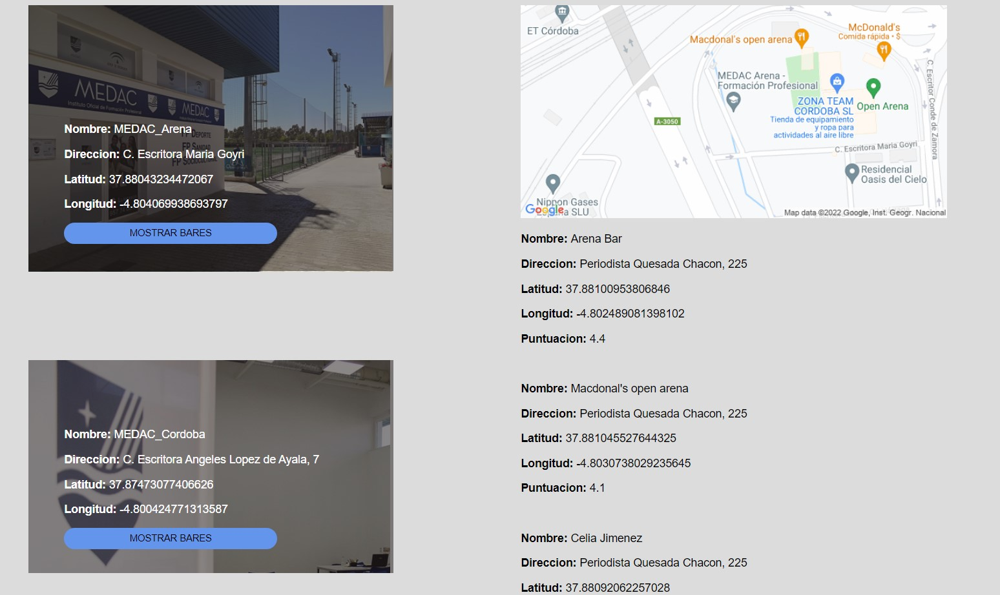

# Practica 9
##  Miguel Castilla Criado 

<a href= '../README.md'>Pagina Principal</a>

<a href= '../P9/'>Ficheros Practica 9</a>

### **Formulario de usuario**

He utilizado cuatro ficheros xml, uno para cada centro y otro dos, uno para cada grupo de bares cercanos a dicho centro.

Solo muestro la explicacion las funciones de un solo centro ya que es el mismo codigo para los dos centros que hay, el unico 
cambio es la localizacion de la API y el nombre de las variables

### Funcion Mostrar Centros

Mediante esta funcion obtengo los datos del fichero xml indicado por la url e indico el tipo de archivo, con el metodo find, obtengo la etiqueta centro del xml indicado anteriormente
    
    
    $(document).ready(function () {
      $.ajax({
        type: "GET",
        url: "escritora.xml",
        dataType: "xml",
        success: function (escritora) {
          $(escritora)
            .find("centro")
            .each(function () {
              nombre = $(this).find("nombre").text();
              direccion = $(this).find("direccion").text();
              latitud = $(this).find("latitud").text();
              longitud = $(this).find("longitud").text();

Esta parte de la funcion muestra los campos nombre, direccion, latitud, longitud y el boton mostrar bares.
Mediante .cordoba.append no sobrescribira los datos mostrados, los pondrá de manera que se muestren todos.

              $(".cordoba").append(
                "

<b>Nombre: </b>" + nombre +"
" +
                "
<b>Direccion: </b>" +direccion +"
" +
                "
<b>Latitud: </b>" + latitud +"
" +
                "
<b>Longitud: </b>" +longitud +`

                <button class='ButtonEscritora  value='bares'>MOSTRAR BARES</button>
                
`
              );
            });
        },
      });
      
### Funcion Mostrar Bares

Esta funcion comenzará al pulsarse el botón "ButtonEscritora", obtendrá los valores del xml "baresCordoba" y al igual 
que en la funcion anterior con el metodo find("bar") cogerá los elementos bar del xml y sacará los  distintos del mismo.
    
    $(document).on("click", ".ButtonEscritora", function () {
            $(".bares").empty();
            mostrar = $.ajax({
              type: "GET",
              url: "baresCordoba.xml",
              dataType: "xml",
              success: function (bares) {
                $(bares)
                  .find("bar")
                  .each(function () {
                    centro = $(this).find("centro").text();
                    nombre = $(this).find("nombre").text();
                    direccion = $(this).find("direccion").text();
                    latitud = $(this).find("latitud").text();
                    longitud = $(this).find("longitud").text();
                    puntuacion = $(this).find("puntuacion").text();

### Funcion Mostrar Bares

Mostrará los bares recogidos en la funcion anterior en el div "bares" en el archivo html, lo añadiremos mediante .append para evitar que sobrescriba datos.

                $(".bares").append(
                  "

<b>Nombre: </b>" +nombre +"
" +
                  "
<b>Direccion: </b>" +direccion +"
" +
                  "
<b>Latitud: </b>" +latitud +"
" +
                  "
<b>Longitud: </b>" +longitud +"
" +
                  "
<b>Puntuacion: </b>" +puntuacion +"
 "
                );
                 });
                 
### Insertar Mapa
    
Mediante la API estatica de googlemaps mostraremos un mapa del centro indicado, será mediante .append que añadirá un mapa sin sobresscribir.
Con .empty eliminaremos todo lo que haya en el div para despues mostrar el mapa.

                $(".map").empty();
                $(".map").append(
                  ``
                );
              },
            });
          });

[Volver arriba](#Practica-9)
